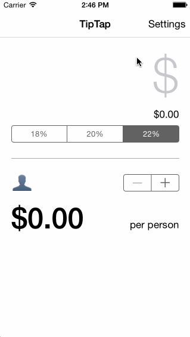

# Codepath iOS Bootcamp pre-work
This is an iPhone application built with Swift for the Codepath iOS Bootcamp pre-work.

Time spent: Roughly 3 hours

Required stories completed:

- Tip calculation, as developed in the walkthrough
- 
- Settings view that allows user to set default tip percentage
- 

Optional stories:

- Location-specific currency symbols. China, Japan, France and Germany are supported.
- 
- Ability to set default tip percentages in the selector
- 
- Ability to calculate value if bill is split between people (up to five)
- 
